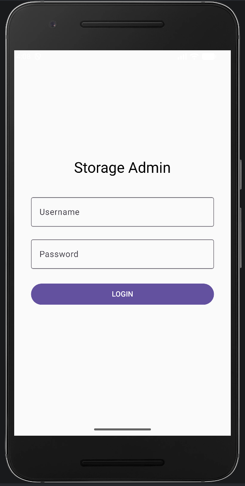
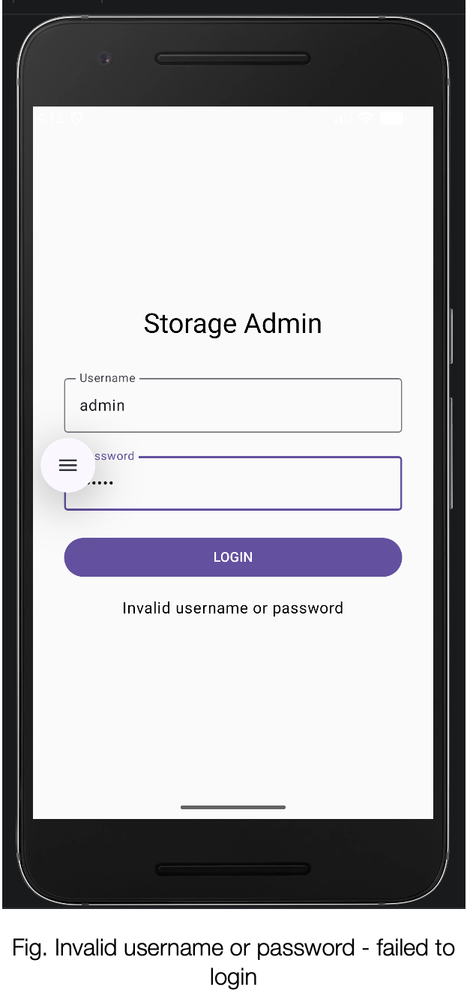
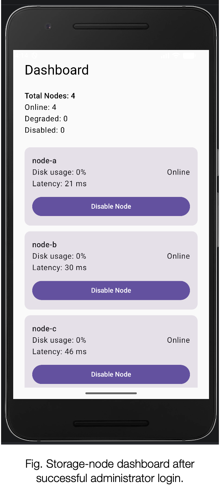
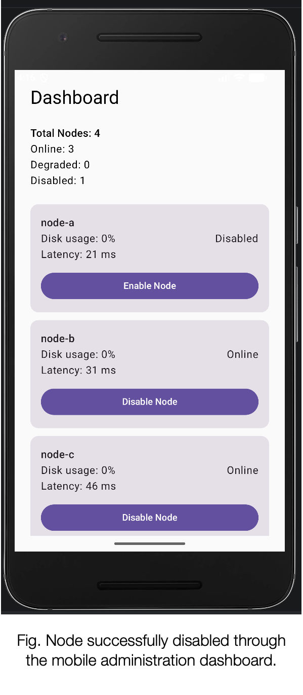
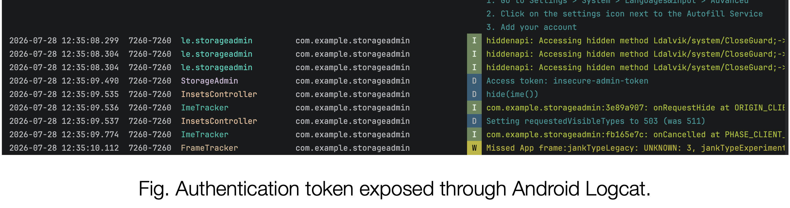
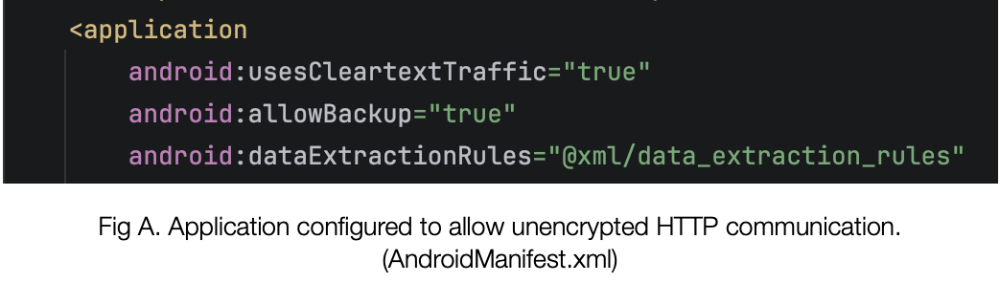
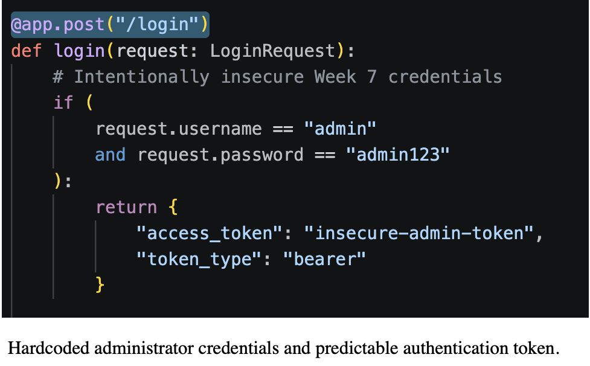
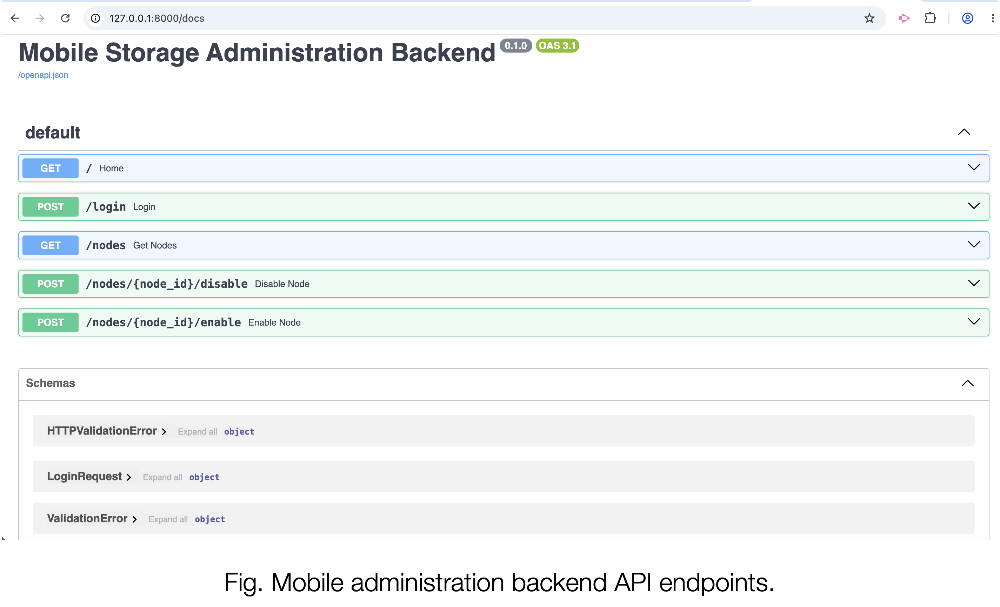

# Secure Mobile Administration App for a Distributed Storage System

A capstone project for a Mobile Security course that demonstrates an Android-based administration application for monitoring and managing storage nodes in a distributed storage system.

The project includes:

- An Android mobile application built with Kotlin and Jetpack Compose
- A FastAPI mobile administration backend
- A Smart Storage Load Balancer
- Four simulated storage nodes
- An intentionally insecure prototype for security analysis
- Static and manual security findings documented with MobSF and runtime testing

> **Important:** This repository contains an intentionally insecure prototype created for educational purposes. Do not deploy it in a production environment.

---

## Project Overview

The Secure Mobile Storage Admin application allows an administrator to:

- Log in to the mobile application
- View storage-node status
- Monitor disk usage and latency
- View total, online, degraded, and disabled node counts
- Disable an active storage node
- Enable a previously disabled node
- Refresh dashboard data after administrative actions

The application monitors four simulated storage nodes:

- `node-a` — port `8001`
- `node-b` — port `8002`
- `node-c` — port `8003`
- `node-d` — port `8004`

---

## Architecture

```text
Android Mobile Application
        |
        | HTTP
        v
Mobile Administration Backend
FastAPI — Port 8000
        |
        | HTTP
        v
Smart Storage Load Balancer
FastAPI — Port 8010
        |
        +-------------------------------+
        |          |          |         |
        v          v          v         v
     node-a      node-b      node-c    node-d
      8001        8002        8003      8004
```

### Android Application

Technologies used:

- Kotlin
- Jetpack Compose
- Retrofit
- Gson Converter
- SharedPreferences

The Android application sends login, node-status, enable-node, and disable-node requests to the mobile administration backend.

### Mobile Administration Backend

The backend is implemented with FastAPI and acts as an adapter between the Android application and the Smart Storage Load Balancer.

Main endpoints:

| Method | Endpoint | Purpose |
|---|---|---|
| `POST` | `/login` | Authenticate the administrator |
| `GET` | `/nodes` | Retrieve storage-node information |
| `POST` | `/nodes/{node_id}/disable` | Disable a selected node |
| `POST` | `/nodes/{node_id}/enable` | Enable a selected node |

### Smart Storage Load Balancer

The load balancer:

- Monitors storage-node health
- Tracks disk usage and latency
- Performs periodic health checks
- Supports node selection
- Handles enable and disable operations

---

## Repository Structure

The exact folder names may vary, but the project generally contains:

```text
project-root/
├── android-app/
│   ├── app/
│   ├── build.gradle.kts
│   └── settings.gradle.kts
├── mobile-backend/
│   ├── main.py
│   └── requirements.txt
├── load-balancer/
│   ├── main.py
│   ├── nodes.yaml
│   └── requirements.txt
├── storage-nodes/
│   └── node services
├── screenshots/
├── reports/
└── README.md
```

Update this section if your repository uses different directory names.

---

## Prerequisites

Install the following tools before running the project:

- Android Studio
- Android SDK and Android Emulator
- Python 3.10 or later
- `pip`
- Git

Optional security tools:

- MobSF
- Jadx GUI
- Android Debug Bridge (`adb`)

---

## Running the Project

The components should be started in this order:

1. Storage nodes
2. Smart Storage Load Balancer
3. Mobile Administration Backend
4. Android application

### 1. Clone the Repository

```bash
git clone <your-repository-url>
cd <your-repository-name>
```

### 2. Create a Python Virtual Environment

Run this step inside each Python backend directory when separate dependencies are used.

```bash
python3 -m venv .venv
source .venv/bin/activate
```

On Windows:

```powershell
.venv\Scripts\activate
```

### 3. Install Python Dependencies

```bash
pip install -r requirements.txt
```

If no `requirements.txt` file is available:

```bash
pip install fastapi uvicorn requests pyyaml
```

### 4. Start the Storage Nodes

Start the four simulated storage-node services on ports `8001` through `8004`.

Example:

```bash
uvicorn main:app --host 0.0.0.0 --port 8001
```

Use the appropriate module or script for each node.

### 5. Start the Smart Storage Load Balancer

```bash
uvicorn main:app --host 0.0.0.0 --port 8010
```

Verify that the load balancer can communicate with all four storage nodes.

### 6. Start the Mobile Administration Backend

```bash
uvicorn main:app --host 0.0.0.0 --port 8000
```

Open the FastAPI Swagger interface at:

```text
http://127.0.0.1:8000/docs
```

### 7. Run the Android Application

1. Open the Android project in Android Studio.
2. Allow Gradle synchronization to finish.
3. Start an Android emulator.
4. Build and run the application.
5. Make sure the backend is running on port `8000`.

The Android emulator accesses the host computer through:

```text
http://10.0.2.2:8000/
```

---

## Prototype Login

The intentionally insecure prototype uses the following hardcoded credentials:

```text
Username: admin
Password: admin123
```

After successful login, the backend returns:

```text
insecure-admin-token
```

These values are included only for controlled testing and vulnerability analysis.

---

## Example API Requests

### Login

```bash
curl -X POST "http://127.0.0.1:8000/login" \
  -H "Content-Type: application/json" \
  -d '{
    "username": "admin",
    "password": "admin123"
  }'
```

### Get Nodes

```bash
curl "http://127.0.0.1:8000/nodes"
```

### Disable a Node

```bash
curl -X POST "http://127.0.0.1:8000/nodes/node-a/disable"
```

### Enable a Node

```bash
curl -X POST "http://127.0.0.1:8000/nodes/node-a/enable"
```

---

## Intentionally Included Security Weaknesses

The Week 7 prototype intentionally includes vulnerabilities so they can be identified and corrected in a secure implementation.

### 1. Cleartext HTTP Communication

The Android application uses:

```text
http://10.0.2.2:8000/
```

The manifest permits cleartext traffic:

```xml
android:usesCleartextTraffic="true"
```

This can expose credentials, tokens, node status information, and administrative requests to interception or modification.

### 2. Hardcoded Credentials

The FastAPI backend compares login requests with fixed administrator credentials.

```text
admin
admin123
```

### 3. Predictable Authentication Token

The backend returns the same fixed token after each successful login:

```text
insecure-admin-token
```

The token does not expire and is not cryptographically signed.

### 4. Insecure Token Storage

The Android application stores the token in normal SharedPreferences:

```kotlin
sharedPreferences
    .edit()
    .putString("access_token", token)
    .apply()
```

The token is not protected using Android Keystore-backed encryption.

### 5. Sensitive Logging

The application writes the token to Logcat:

```kotlin
Log.d("StorageAdmin", "Access token: $token")
```

### 6. Missing Reauthentication

The application allows administrators to enable or disable storage nodes without biometric confirmation, device credentials, or a reauthentication prompt.

### 7. Missing Authorization Enforcement

The enable and disable endpoints do not properly validate the authentication token before performing administrative actions.

---

## MobSF Findings

Static analysis identified several security concerns, including:

- Cleartext traffic enabled
- Debug build enabled
- Debug certificate used
- Support for an older Android version
- Application data backup enabled
- Sensitive information logged
- Possible hardcoded sensitive information
- Hardcoded IP address disclosure
- Exported components

MobSF also reported SSL certificate pinning as a positive finding. However, because the prototype uses cleartext HTTP, this result should be manually verified during dynamic testing.

---

## Manual Security Findings

Manual code review and runtime testing confirmed:

- Hardcoded backend credentials
- Predictable authentication token
- Missing token validation
- No biometric or device-credential confirmation
- Authentication token exposure in Logcat
- Unencrypted token storage in SharedPreferences
- Temporary node-state transitions during health-check refreshes

---

## Security Improvements

A secure version should include the following protections:

- Replace HTTP with HTTPS
- Disable cleartext traffic
- Remove hardcoded credentials
- Use unique administrator accounts
- Store password hashes instead of plaintext passwords
- Add account lockout and rate limiting
- Issue signed, random, and expiring authentication tokens
- Validate authorization on every protected endpoint
- Store sensitive values using Android Keystore-backed encryption
- Remove sensitive Logcat statements
- Disable debugging in release builds
- Sign release APKs with a private release certificate
- Disable application backup for sensitive data
- Review and restrict exported components
- Require biometric or device-credential confirmation for critical actions
- Validate certificate pinning through dynamic testing

---

## Building the APK

From Android Studio:

1. Select **Build**.
2. Select **Build Bundle(s) / APK(s)**.
3. Select **Build APK(s)**.

The debug APK is usually generated at:

```text
app/build/outputs/apk/debug/app-debug.apk
```

From the command line:

```bash
./gradlew assembleDebug
```

On Windows:

```powershell
gradlew.bat assembleDebug
```

---

## Security Testing

### MobSF

1. Build the APK.
2. Open MobSF.
3. Upload `app-debug.apk`.
4. Review:
   - Manifest Analysis
   - Code Analysis
   - Certificate Analysis
   - Network Security findings
   - Exported components
   - Logging and hardcoded-value findings

### Jadx

Open the APK in Jadx GUI to review:

- `MainActivity`
- `RetrofitClient`
- `LoginRequest`
- SharedPreferences usage
- Logcat statements
- Backend URLs
- Hardcoded values

### Logcat

Filter Logcat using:

```text
StorageAdmin
```

The insecure prototype may display:

```text
Access token: insecure-admin-token
```

---

## Screenshots and Evidence

The project report includes evidence for:

- Login screen
- Failed login
- Successful dashboard login
- Disabled node
- Enabled node
- Token exposure in Logcat
- SharedPreferences token storage
- Cleartext HTTP configuration
- FastAPI login endpoint
- FastAPI Swagger interface
- MobSF findings

Store screenshots in a dedicated directory such as:

## Screenshots

### Login Screen

<p align="center">
  
</p>

### Failed Login

<p align="center">
  
</p>

### Dashboard

<p align="center">
  
</p>

### Disabled Node

<p align="center">
  
</p>

### Enabled Node

<p align="center">
  
</p>

### Logcat Token Exposure

<p align="center">
  
</p>

### Cleartext HTTP Configuration

<p align="center">
  
</p>

### FastAPI Login Endpoint

<p align="center">
  
</p>

### FastAPI Swagger Interface

<p align="center">
  
</p>

---

## Educational Purpose

This project was created to demonstrate how insecure design decisions affect a mobile administration application. It provides a baseline for identifying vulnerabilities, documenting their impact, and implementing stronger security controls.

The intentionally vulnerable version should only be used in a controlled lab environment.

---

## Author

**Noreen Arshad**

Course: Mobile Security  
Project Type: Capstone Project

---

## License

This project is intended for academic and educational use. Add an open-source license only if required by your course or repository policy.
